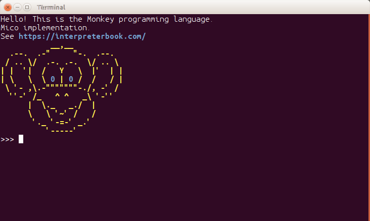

# Mico

Monkey the language interpreter implementation done with C++. https://interpreterbook.com/



## Difference

"Mico" is an implementation but of course it has some difference.
It's so funny to add something new =)

#### * Tail call optimization.

```js
    let spin = fn( count ) {
        if( count > 0 ) {
            spin(count - 1)
        } else {
            "Ok"
        }
    }
    spin( 0xFFFFFFFF ) // Ok, Here is a tail call

    let spin = fn( count ) {
        if( count > 0 ) {
            spin(count - 1)
            "Ok"
        }
        count
    }
    spin( 10000 ) /// Oops. Stack overflow is here
```

#### * Line number for the tokens.
Yeap. Now I can see where an error happens.
```js
    let test_val = someUnknownCall()
    error: [1:15] Identifier not found 'someUnknownCall'
```

#### * Floating point numbers
```js
    let t = 0.0001          // t = 0.0001
    let r = 1e100           // r = 1e+100
    let test = .55 / .11    // test = 5
```

#### * Number formats.

It's possible to add DEC, OCT, TER, BIN and HEX number
```D
    123456         // decimal
    01234567       // oct 342391
    0b010101010101 // bin 1365
    0t02120120     // ternary 1878
    0xDEADBEEF     // hex 3735928559
```

#### * Number's gap symbol `_`
```D
    1_123_456          // decimal
    01_234_567         // oct 342391
    0b0101_0101_0101   // bin 1365
    0t2_120_120        // ternary 1878
    0xDEAD_BEEF        // hex 3735928559
    0.000_000_000_1    // float 1e-10
```

#### * Assignment operator `=`

```js
    let a = 0
    a = 100             // a = 100
    b = 0               // error: [1:0] Identifier not found: 'b'
    let m = [1, 2, 4]
    m[2] = 3            // m = [1, 2, 3]
    let m = { "one":1, "two":2, "three":4 }
    m["three"] = 3      // { "three":3, "two":2, "one":1 }

    // assignment is a `right arm` operator.
    let a = [1,2,3,4,5]
    a[0] = a[1] = a[2] = a[3] = a[4] = 0
    // a = [0, 0, 0, 0, 0]
```

#### * Reference object
The object that contains another object.
Now I can change the values in arrays, tables (hashes) and the environment
```js
    m["three"] = 3 // m["three"] returns a reference object
                   // and then assign the operator changes the value
```

#### * **elif** branch to **ifelse**

 Well...there is nothing to explain here =)
```js
    let result = if( x < 0 ) {
                   "too small!"
                 } elif(x == 0) {
                   "zero"
                 } elif( x < 10 ) {
                   "less than 10"
                 } elif( x < 100 ) {
                   "less than 100"
                 } else {
                   "too big!"
                 }
```

#### * Hashes (i.e. tables) and Arrays

Can be the keys for the other Hashes
```js
    // should work!
    let point = fn( x, y, z ) { {"x": x, "y": y, "z": z} }
    let table = {
        point(0, 0, 1): 0.1,
        point(0, 1, 0): 0.2,
        point(0, 1, 1): 0.3,
        point(1, 0, 0): 0.4,
        point(1, 0, 1): 0.5,
        point(1, 1, 0): 0.6,
        point(1, 1, 1): 0.7,
    }
    // table[point(0, 1, 1)] // 0.3

    // Keys are immutable. So you cant change their values.
    let p = point(1, 100, 200)
    let t = {p: false} // here `p` is cloned
    p["x"] = -1
    // now `p` is a hash {"x": -1, "y": 100, "z": 200}
    // but `t` still has an unique key {"x": 1, "y": 100, "z": 200}
    // `t` = {{"x": 1, "y": 100, "z": 200}: false}
    t[point(1, 100, 200)] // returns false
```
#### * Assignment arrays' elements

There are some tricks.
```js
    let a = [0,0] // ok. here we have a value `a` that binds an array [0,0]
    let b = [a, a] // wow wow wow! Here we put the array `a` to another array
                   // b == [[0, 0], [0, 0]] Cool, eh?
    a[0] = 1 // what happens here? We've changed the first value of the array `a`
             // `b` also has been changed!
             // now b is [[1, 0], [1, 0]]
    /// but what if ...
    a[1] = b // ?
    // well...nothing bad has happend here. Because `a[1]` is just the old value of `b`
    // now `a` is [1, [[1, 0], [1, 0]]]
    //            ^a  ^b`````````````
    // and what is `b` now?
    // It's easy. `b` is [a, a]...so
    // [
    //   [1, [[1, 0], [1, 0]]], // b[0] == a
    //   [1, [[1, 0], [1, 0]]]  // b[1] == a
    // ]
    //
    // But what if we what just a value and not the reference in the array?
    //
    // we can just `copy` it. `copy` is a builtin function that returns a new object
    let a = [0, 0]
    let b = [a, copy(a)] // b = [[0, 0], [0, 0]]
    a[0] = 1             // b = [[1, 0], [0, 0]]
```

#### * Operators %, |, &, ^, &&, ||, >>, <<, ~

```js

    // ^  - xor
    // %  - mod
    // >> - shift left
    // << - shift right
    // ~  - bit not

    let bits = fn( value ) {
        let impl = fn( val, acc ) {
            if( val > 0 ) {
                impl( val >> 1, acc + (val & 2) )
            } else {
                acc
            }
        }
        impl( value, 0 )
    }
    bits(0xFFFFFFFFF)               // => 36
    bits(0b1111111000000001111111)  // => 14
```

#### * Function call rules

Partial application. A function that accepts N parameters can be called with `M` = `0..N-1` parameters. In this case the function returns another function that accepts `N` - `M` parameters. Hello, OCaml

```js
    let sum1 = fn(a,b,c) { a + b + c }
    let sum2 = sum1(1)  // => fn(a, b) { 1 + a + b }
    let sum3 = sum2(2)  // => fn(a) { 1 + 2 + a }
    sum2(10, 20)        // => 31
    sum3(1000)          // => 1003
    sum1( )             // => fn(a,b,c) { a + b + c }
    sum1(1)(2)(3)       // => 6; equal to sum(1, 2, 3)

    /// function can be restored back from its partial form
    /// just use prefix asterisk `*` for this.

    let old_sum = *sum3 // now old_sum is equal to sum1 i.e. fn(a,b,c) { a + b + c }
    old_sum(1,2,3)      // oh, yeah, => sum1(1, 2, 3) => 6

    /// we can rebind the argument for a function

    let sum3 = (*sum3)(100, 100) /// now sum3 is fn(a) { 100 + 100 + a }
                                 /// here we use (*sum3) in the parentheses because `*`
                                 /// has lower precedence then `call` operator `()`

    sum3(100)  /// => 300

    /// of course this code is also valid
    (*sum3)(0.23, 0.56, 0.79) /// => 1.58
    (*sum3)("Hello", ", ", "world!") /// => "Hello, world!"

    /// and what if ...
    *sum1 /// well, it doesn't make sense and the operator returns its operand.

    /// another example
    let get_sum = fn( n ) {
        let impl = fn( a, b ) { a + b }
        impl( n ) // returns a function that accepts 1 argument
    }
    let s = get_sum(10) // now s id fn( a ) { 10 + a }
    (*s)(20, 30)         // ok. fn( a, b ) { a + b } is called => 50

```

#### * Pipe operator for function.
The pipe operator `|` is a shortcat for the `call` operator. The left side of the operator  is passed to the right side. In this case the right side must be a function (builtin or not).
```js
    let sum = fn(a,b) { a + b }
    let hello = sum("Hello, ")      // fn( a ) { "Hello, " + a }
    "Hello, world!"|len             // => 13
    "world!"|hello                  // sum("Hello, ", "world!") => "Hello, world!"
    "world!"|sum("Hello, ")|len     // len(sum("Hello, ", "world!")) => 13

    /// check this out =)
    let x = 10
    "world!" | if(x > 0){hello} else {(*hello)("Goodbay, ")} // => Hello, world!
    x = 0
    "world!" | if(x > 0){hello} else {(*hello)("Goodbay, ")} // => Goodbay, world!

```

Is not yet complete.

### ... are not supported yet

#### block comments
```js
/*
This is a block of comments
*/
let a = 0
```

#### A Macro System For Monkey

https://interpreterbook.com/lost/

Nope. I have not started to implement it.
